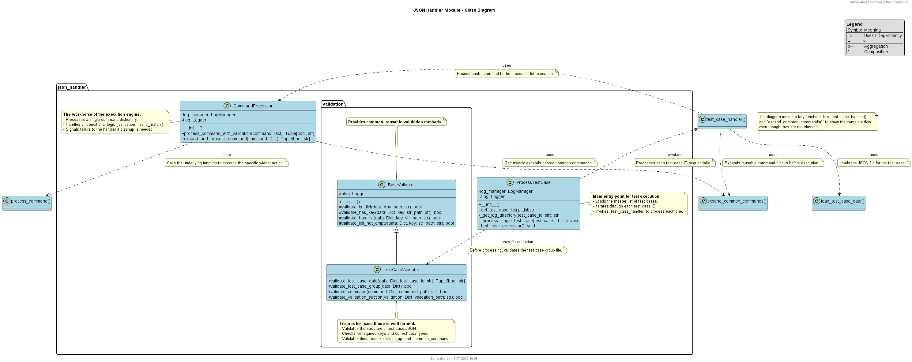
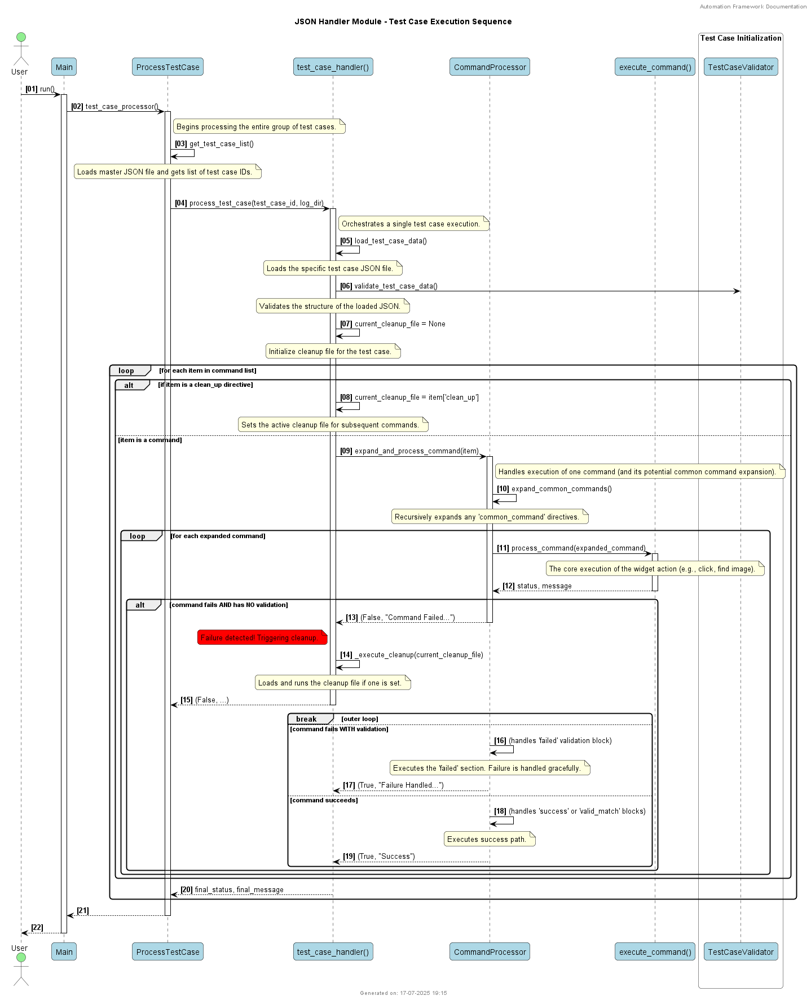

# JSON Handler Module

## Overview

The `json_handler` module is the core engine responsible for parsing and executing test cases defined in JSON format. It provides a robust and flexible system for test automation, featuring reusable command blocks, conditional execution, and a generic cleanup mechanism.

This document details the architecture, folder structure, class responsibilities, and execution flow of the module.

## Folder Structure

```
json_handler/
├── document/
│   ├── class_diagram.puml
│   └── sequence_diagram.puml
├── validation/
│   ├── __init__.py
│   ├── base_validator.py
│   └── test_case_validator.py
├── __init__.py
├── test_case_command_processor.py
├── test_case_common_command.py
├── test_case_handler.py
├── test_case_helper.py
└── test_case_processor.py
```

---

## Architecture and Design

The module follows a pipeline architecture where test cases are loaded, validated, expanded, and then executed sequentially.

### Class Diagram

The following diagram illustrates the key classes and their relationships:



### Sequence Diagram

The sequence diagram below shows the end-to-end flow of processing a single test case:



---

## Class and Module Documentation

### `test_case_processor.py`

*   **Class `ProcessTestCase`**: This is the main entry point for the test execution process. It is responsible for:
    *   Loading the main test case group file (e.g., `master.json`).
    *   Iterating through the list of test case IDs.
    *   Invoking `test_case_handler.process_test_case` for each test case.
    *   Initializing and managing test-case-specific loggers.

### `test_case_handler.py`

*   **Function `process_test_case`**: This function orchestrates the execution of a single test case file. Its responsibilities include:
    *   Loading the test case JSON data.
    *   Validating the test case structure using `TestCaseValidator`.
    *   Managing the new generic `clean_up` mechanism by tracking the current cleanup file.
    *   Iterating through the list of commands and directives within the test case.
    *   Passing commands to the `CommandProcessor` for execution.
    *   Triggering the cleanup process by calling `_execute_cleanup` if a command fails without its own validation block.
*   **Function `_execute_cleanup`**: A helper function that loads and executes the commands from a specified cleanup JSON file.

### `test_case_command_processor.py`

*   **Class `CommandProcessor`**: This class is the workhorse of the execution engine. It processes individual commands.
    *   **`process_command_with_validation`**: Executes a single command and handles all conditional logic.
        *   If the command fails, it checks for `validation` or `valid_match` blocks.
        *   If no validation is present for a failed command, it returns a failure status, signaling the `test_case_handler` to trigger a cleanup.
        *   If validation is present, it executes the `failed` block and returns a success status, allowing the test case to continue.
        *   It also handles the `success` and `valid_match` blocks for successful commands.
    *   **`expand_and_process_command`**: A wrapper that first expands any `common_command` and then sends it for processing.

### `test_case_common_command.py`

*   **Function `expand_common_commands`**: A recursive function that processes a list of commands and replaces any `common_command` directive with the actual list of commands from the referenced file. This allows for creating reusable command libraries.

### `test_case_helper.py`

*   Contains helper functions, primarily `load_json` and `load_test_case_data`, for reading and parsing JSON files from the disk.

### `validation/`

*   **`test_case_validator.py`**:
    *   **Class `TestCaseValidator`**: Responsible for validating the structure of test case files before execution. It ensures that the JSON contains all required keys, that commands are well-formed, and that new directives like `clean_up` are structurally correct.
*   **`base_validator.py`**:
    *   **Class `BaseValidator`**: Provides a set of basic, reusable validation methods (e.g., `validate_is_dict`, `validate_has_list`).

---

## Key Concepts and Execution Flow

1.  **Test Case Group**: Execution starts with a "master" JSON file that contains a list of test case IDs to be run in sequence.
2.  **Directives vs. Commands**: A test case file contains a list of dictionaries. These can be:
    *   **Directives**: Such as `{"clean_up": "file.json"}` or `{"common_command": "file.json"}`. These are not executed directly but control the behavior of the test runner.
    *   **Commands**: Dictionaries that define an action to be performed (e.g., click a button, find an image).
3.  **Cleanup Handling**: The `clean_up` directive sets the active cleanup file for all subsequent commands until the next `clean_up` directive is encountered. If any of these subsequent commands fail without a `validation` block, the commands in the active cleanup file are executed, and the test case is terminated.
4.  **Conditional Logic**: The `validation` and `valid_match` blocks provide powerful, command-level conditional execution, allowing tests to react to different outcomes without failing the entire test case.
